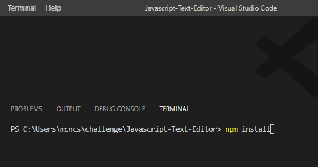
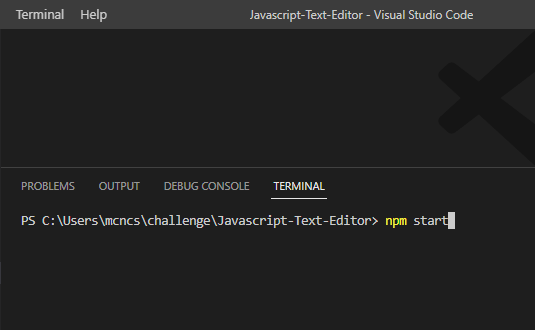

# Javascript-Text-Editor

## Description
This text editor PWA so a single page PWA that allows the user to edit there code with a nice color coordinated UI tell help for readability. This PWA is installable just by using the install button located at the top of the page. Happy Hacking!

## TABLE OF CONTENTS:
[Usage](#usage) <br/>
[Step-1](#step-1)<br/>
[Step-2](#step-2)<br/>
[Step-3](#step-3)<br/>
[License](#license)<br/>


## Usage
ONLY FOR PERSONAL USE

### Step 1

Navigate to your terminal and run the command ```npm install```. This will take care of install all necessary dependencies that that we are ready to launch.



### Step 2

Then you'll need to run the command ```npm start```. This will launch the backend and generate our front end dist folder and you'll be ready to use and develop further if you so choose!



### Step 3

Time to test it out! Open you browser and launch http://localhost:3000/


        
## License
 [](https://opensource.org/licenses/MIT)